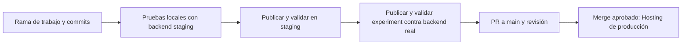

# Cómo trabajar y publicar a partir de ahora

## Dos backends y tres destinos web, con ramas y PR

El recorrido inicial elegido es **local → staging → experiment → producción**. Experiment comprueba el frontend contra el backend real antes del merge. Más adelante puedes omitir ese paso simplemente dejando de ejecutar su comando; no hace falta cambiar los otros despliegues.

- **Staging** es la zona de desarrollo y pruebas: https://fertiliapp-staging.web.app.
- **Producción** es la app que utilizan las usuarias, con el backend `rnf-app`.
- **Experiment** es otra web conectada al mismo Auth, Firestore y Functions de producción. Permite detectar incompatibilidades con las reglas o funciones reales; las operaciones que hagas allí pueden modificar datos reales. No prueba de forma aislada cambios nuevos de reglas.



Un **commit** guarda una versión del código. Un **push** envía los commits a GitHub. Un **PR** propone incorporar una rama a otra. Un **deploy** publica una versión de la aplicación. Son acciones distintas: no hay que fusionar a main para ver una mejora publicada en staging.

## Qué dirección usar

| Dirección | Para qué sirve ahora |
| --- | --- |
| `http://localhost:5174` | Ver los cambios mientras programas; usa las cuentas y la base de staging. |
| https://fertiliapp-staging.web.app | Probar la versión publicada, compartirla con testers e instalar la PWA de pruebas. |
| https://experiment.fertiliapp.com | Validación opcional contra `rnf-app`; mismo backend que producción. |
| https://rnf-app-experiment.web.app | Mismo sitio experiment, con dominio de Firebase. |
| https://rnf-app.web.app | Frontend de producción; mismo backend que experiment. |

IONOS proporciona el dominio y sus registros DNS. Firebase Hosting sirve la web. La configuración incluida en esa web determina a qué Auth, Firestore y Functions se conecta. **El nombre del dominio, por sí solo, no separa las cuentas ni los datos.**

Se mantiene `experiment.fertiliapp.com` donde está. Staging tiene su dirección independiente `fertiliapp-staging.web.app`. No se ha cambiado DNS ni la asociación de dominios.

| Acción | Efecto con los workflows preparados |
| --- | --- |
| Commit en `mayo_interpertacion` | Guarda el código localmente; no publica ninguna web. |
| Push de esa rama con estos workflows incluidos | Sube código a GitHub; no despliega staging ni experiment automáticamente. |
| `build:staging` + `deploy:staging:hosting` | Publica el código local compilado en staging, incluso sin commit. |
| `deploy:experiment:hosting` | Comprueba el destino, recompila el código local para producción y publica solo experiment. |
| Abrir o actualizar PR a main | Ejecuta validación; no publica producción. |
| Merge a main (o push directo a main) | Dispara el workflow de Hosting de producción; se publica cuando termina correctamente. |
| Ejecutar manualmente el workflow Experiment | Publica la rama elegida en el sitio experiment usando backend de producción. |

## Rutina para cada mejora

1. **Trabaja en una rama**, nunca directamente en main. Puedes continuar la rama actual para terminar esta preparación y usar ramas nuevas para las siguientes mejoras.
2. Ejecuta `npm run dev` y abre `http://localhost:5174`. Los cambios locales aparecen mientras programas. Las lecturas y escrituras van al backend compartido de staging: no es una base de datos local.
3. Haz tus **commits en la rama de trabajo** y ejecuta las pruebas relevantes. Publica la versión que quieres validar:

   ```powershell
   npm run test:staging
   npm run build:staging
   npm run deploy:staging:hosting
   ```

4. **Prueba esa versión en https://fertiliapp-staging.web.app.** Inicia sesión con una cuenta creada en staging. Las cuentas de producción no se copian automáticamente. Conserva datos sintéticos de prueba. Staging es compartido: el último despliegue cambia lo que ven todos sus testers.
5. Cuando staging esté validado, ejecuta **`npm run deploy:experiment:hosting`** desde la misma rama y prueba https://experiment.fertiliapp.com. El comando recompila automáticamente para el backend de producción. Después haz **push y PR a main**. Incluye en el PR qué cambió, qué versión probaste y qué comprobaciones pasaron. Si corriges el código después de probarlo, vuelve a validar la nueva versión en staging y experiment antes de fusionar.
6. **Revisa y fusiona el PR** cuando quieras publicarlo para las usuarias. El workflow de Firebase Hosting en main compila con las variables de producción y publica únicamente el frontend de producción. Así mantienes la forma de trabajar con PR que ya conoces, con una validación en staging antes de la fusión.

Puedes abrir el PR antes, como borrador; lo importante es que la validación de staging suceda antes del merge.

**Al pasar a producción se mueve el código aprobado, no las cuentas ni los datos de staging.** Producción continúa usando sus propios datos. Cambiar el código puede alterar cómo los lee o escribe: esos efectos deben revisarse en el PR.

## Publicar experiment contra el backend real

**Desde la terminal local o pidiéndoselo al agente, sin entrar en GitHub Actions:**

```powershell
npm run deploy:experiment:hosting
```

Este comando funciona antes de fusionar los workflows a main. Utiliza tu sesión local de Firebase CLI y las variables de producción ya disponibles en el `.env` local ignorado por Git. No copia cuentas, datos ni secretos de staging.

Antes de publicar comprueba el proyecto **`rnf-app` (`771820334247`)**, la pertenencia del sitio **`rnf-app-experiment`** y la existencia de **`sessionApi` en `us-central1`**. Rechaza configuraciones mezcladas y argumentos para cambiar el destino; recompila siempre con el modo `production` y comprueba que el build no cambie antes del despliegue. Si alguna comprobación o la compilación falla, no publica.

Usa `firebase.experiment.json`, que solo contiene Hosting de experiment, y fija `--project rnf-app --only hosting:experiment`. No despliega el sitio principal, reglas, índices ni Functions. Publicar experiment sí reemplaza la web que ven sus visitantes y los APK antiguos conectados a ella.

Para comprobar configuración, acceso de lectura a Firebase y compilación **sin publicar**:

```powershell
npm run check:experiment
```

Las comprobaciones automáticas de rechazo de destino y alcance se ejecutan con `npm run test:experiment`. No necesitan credenciales ni realizan peticiones a Firebase.

Los despliegues locales publican los archivos actuales, incluidos los cambios sin commit. Para probar la misma revisión en staging y experiment, no cambies el código entre ambos pasos. Guarda un commit de referencia y valida de nuevo si haces correcciones. Hacer commit o push no sustituye estos comandos ni provoca su ejecución automática.

**Alternativa en GitHub Actions:** se conserva el target `experiment` → `rnf-app-experiment` en `.firebaserc` y `firebase.json`. El workflow `.github/workflows/Firebase_hosting_experiment.yml` sigue siendo manual; no publica al hacer push a `mayo_interpertacion`.

Una vez incorporada esta definición a main, abre GitHub → Actions → **Experiment Hosting (manual, production backend)** → **Run workflow**, elige la rama que quieres probar y confirma el uso del backend de producción. Compila con las mismas variables que producción y despliega únicamente Hosting con `projectId: rnf-app`, `target: experiment`. No despliega reglas ni Functions ni el sitio principal.

Para poder ejecutar un workflow manual, su definición debe existir en la rama predeterminada; luego se puede seleccionar otra rama para ejecutarlo. [Documentación de GitHub](https://docs.github.com/en/actions/how-tos/manage-workflow-runs/manually-run-a-workflow).

La primera incorporación de estos workflows a main también disparará el despliegue habitual de producción: revisar ese primer PR antes de fusionarlo. No se ha ejecutado ningún workflow ni publicado experiment en esta preparación. Sus secretos existentes de producción no se han cambiado ni se han validado mediante una ejecución remota.

Experiment comparte usuarios, datos, reglas y correos de soporte reales. Usa una cuenta de prueba y operaciones deliberadas; no envíes correos de soporte como prueba. Si un flujo pasa en staging pero falla en experiment por una regla que falta, prepara el cambio de backend de producción para revisión: publicar experiment no lo aplica y cambiar esa regla de producción afectaría también a las usuarias actuales.

## A dónde apunta la app Android

- **Configuración actual y assets sincronizados:** `https://fertiliapp-staging.web.app`. El próximo APK de staging usa el identificador separado `com.fertiliapp.fertiliapp.staging` y el nombre **FertiliApp Pruebas**.
- **Compilación explícita con `CAPACITOR_ENV=production`:** `https://rnf-app.web.app`; requiere build, sync y compilación nativa con ese mismo entorno.
- **APK ya instalado:** conserva la URL con la que se compiló. La configuración anterior del repositorio apuntaba a `https://rnf-app-experiment.web.app`; un APK construido con ella seguirá abriendo experiment. Un commit o merge no cambia esa URL nativa. No se ha instalado un APK nuevo ni comprobado un dispositivo físico.
- **PWA:** permanece en el dominio desde el que se instaló. La PWA de experiment y la de staging abren sus respectivos entornos.

## Si la mejora incluye backend

Publicar Hosting no publica Functions, reglas ni índices. Si modificas `sessionApi`, primero prueba y despliega esa Function de staging:

```powershell
npm run prepare:staging:session
npm ci --prefix .firebase/session-staging --ignore-scripts --no-audit --no-fund
npm run test:staging:session
npm run deploy:staging:session
```

Después publica/prueba el frontend. Para producción, cualquier cambio de Functions, reglas, índices o datos necesita su propio despliegue revisado; no se ejecuta por hacer merge del frontend.

Nunca uses `firebase deploy` a secas: el proyecto predeterminado de la CLI sigue siendo **rnf-app**. Los comandos `deploy:staging:*` fijan explícitamente `--project fertiliapp-staging` y comprueban el destino.

## Qué está automatizado y qué falta publicar en Git

Ahora mismo staging ya funciona y el despliegue local está disponible. Su workflow de GitHub está preparado como **manual**, sin activar: no necesitas configurar automatización para empezar a desarrollar y probar.

Los cambios de esta preparación todavía están locales, sin commit/push. Antes del siguiente push/PR hay que revisar e incluir la configuración y los workflows preparados. Hasta entonces, GitHub conserva los workflows anteriores, incluido el antiguo despliegue experimental al hacer push a su rama.

Después de publicar esos cambios de configuración, el esquema preparado será:

- PR: comprobaciones; sin despliegue a producción.
- Staging: comandos locales o workflow manual cuando se configure y autorice su identidad independiente.
- Experiment: comando local `deploy:experiment:hosting` o workflow manual alternativo, usando el target `experiment` explícito. El comando local no depende de configurar GitHub.
- Main: publicación del frontend en Firebase Hosting de producción.
- GitHub Pages heredado: manual y desactivado por defecto.

Los detalles de cuentas técnicas, pruebas realizadas, Capacitor y decisiones opcionales están en [Firebase staging](firebase-staging.md). No hay que copiar ni versionar archivos `.env`, contraseñas o claves para seguir este proceso.
